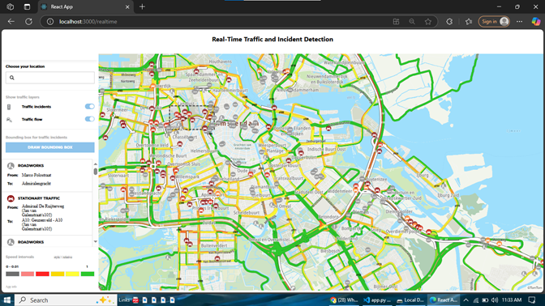

# 🚦 AI-Powered Smart Traffic Monitoring and Congestion Prediction System  

## 📌 Introduction  
Urban traffic congestion is a growing challenge, causing increased travel time, higher fuel consumption, and environmental pollution. Traditional traffic monitoring systems rely on static cameras and manual analysis, which are inefficient for handling large-scale, real-time data.  

This project introduces an **AI-Powered Smart Traffic Monitoring and Congestion Prediction System** that integrates **real-time traffic feeds**, **weather conditions**, and **historical traffic data** to:  
- Detect and visualize real-time traffic conditions and incidents.  
- Predict congestion levels using machine learning models.  
- Suggest alternate routes dynamically based on traffic and weather.  

---

## 🛠️ Features  
- 🔴 **Real-time traffic and incident visualization** using TomTom API  
- 📊 **Congestion prediction** with a trained LightGBM classifier  
- 🛣️ **Alternate route recommendations** integrating traffic, weather, and route geometry  
- 🌦️ **Weather-aware predictions** using Open-Meteo API  
- 🗺️ **Interactive frontend** built with React + Leaflet.js  
- 🚨 **Alerts and notifications** for severe congestion or incidents  

---

## 📊 System Architecture  
1. **Backend (Python)**  
   - Data ingestion from **TomTom**, **Open-Meteo**, and **OpenRouteService** APIs  
   - Machine learning core (LightGBM Classifier)  
   - Real-time processing, congestion predictions, and alerting  
   - Alternate route ranking and recommendation  

2. **Frontend (React)**  
   - Interactive map-based interface with **Leaflet.js**  
   - Real-time incident and traffic flow overlays  
   - User inputs for origin/destination and congestion forecasts  

---

## 📂 Project Structure
```
├── backend/                 # Python backend
│   ├── api/                # API interaction modules
│   ├── models/             # Trained ML models (LGBM, etc.)
│   ├── processing/         # Data cleaning & feature engineering
│   ├── routes/             # Route recommendation logic
│   └── app.py              # Main Flask/FastAPI entrypoint
├── frontend/               # React frontend
│   ├── src/
│   │   ├── pages/
│   │   │   ├── Home.jsx
│   │   │   ├── RealTime.jsx
│   │   │   └── Forecast.jsx
│   │   └── components/
│   └── package.json
├── notebooks/              # Jupyter notebooks for exploration & training
├── data/                   # Sample / preprocessed datasets
├── docs/                   # Documentation and screenshots
│   └── interface.png
├── README.md               # Project documentation
└── requirements.txt        # Python dependencies
```

---

## 📊 Dataset Sources  
### Real-time Data (APIs)  
- **TomTom API** – Live traffic incidents, flow, and density  
- **Open-Meteo API** – Weather data (rain, fog, temperature)  
- **OpenRouteService API** – Route geometry (lat/long)  

### Historical Data (Model Training)  
- **US Traffic Congestions (2016–2022)** – [Kaggle Dataset](https://www.kaggle.com/datasets/sobhanmoosavi/us-traffic-congestions-2016-2022/data)  

---

## 🤖 Machine Learning  
- **Model Used**: LightGBM (LGBM Classifier)  
- **Training**: 80/20 train-test split  
- **Metrics**: Accuracy, Precision, Recall, F1-score, Confusion Matrix  
- **Feature Engineering**: is_weekend, is_rushhour, weather categories, etc.  

---

## 🚀 Installation & Setup  

### 1. Clone Repository
```bash
git clone https://github.com/your-username/AI-Powered-Smart-Traffic-Monitoring-and-Congestion-Prediction-System.git
cd AI-Powered-Smart-Traffic-Monitoring-and-Congestion-Prediction-System
```

### 2. Backend Setup
```bash
cd backend
pip install -r requirements.txt
python app.py
```

### 3. Frontend Setup
```bash
cd frontend
npm install
npm start
```

---

## 📸 Screenshot

### Real-Time Traffic Viewer Interface



---

## 📈 Results & Insights

* Majority of traffic is **moderate to fast (\~76%)**
* **Peak congestion**: 8–9 AM and 5–8 PM (evening peak higher)
* Weather significantly impacts congestion (rain/snow → higher delays)
* LGBM classifier achieved **high accuracy** in congestion prediction
